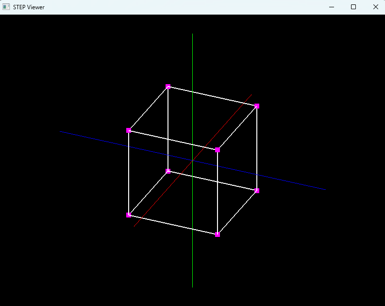
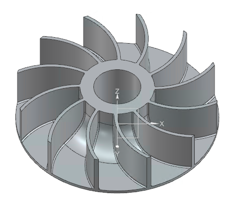
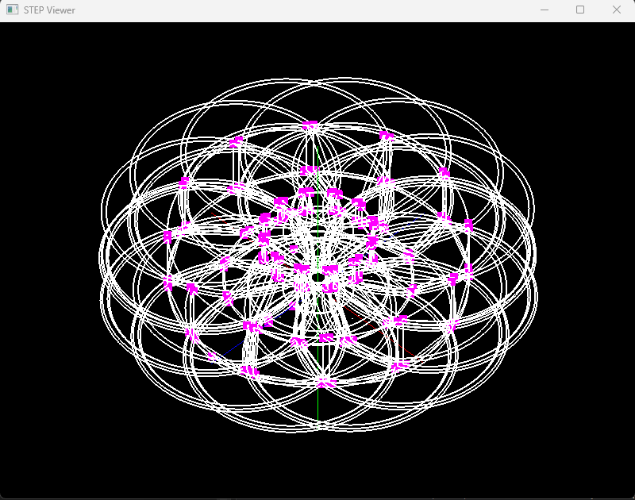

# STEPViewer
 
STEPViewer is a lightweight 3D visualization tool for STEP geometry.
This project is part of an ongoing experiment focused on:

- Computational Geometry
- B-Rep Topology
- STEP Data Structures
- OpenGL Rendering
- CAD Visualization

## Screenshot
Wireframe cube rendered from STEP geometry.
| Key | Action |
|------|---------|
| Up / Down | Rotate around X-axis |
| Left / Right | Rotate around Y-axis |
| W / S | Zoom In / Out |

 

Wireframe cube rendered image

 

Open Impeller Step file

 

Open Impeller Rendered image

## Current Features
- GLFW Window Creation
- OpenGL Context Initialization
- Orthographic Camera
- Camera Zoom (Keyboard)
- Camera Orbit (Yaw / Pitch)
- GeoKernel3D Integration
- STEP File Loading
- CARTESIAN_POINT Parsing
- VERTEX_POINT Parsing
- EDGE_CURVE Parsing
- STEP EDGE_CURVE parsing
- Point Rendering
- Vertex Rendering
- Edge Rendering
- STEP wireframe rendering
 
## Planned Features
- STEP face visualization
- Camera panning
- GeoKernel3D topology visualization
- GeoKernel3D integration
 
## Related Projects
- GeoKernel3D
- STEPInspector
- MiniCAD
